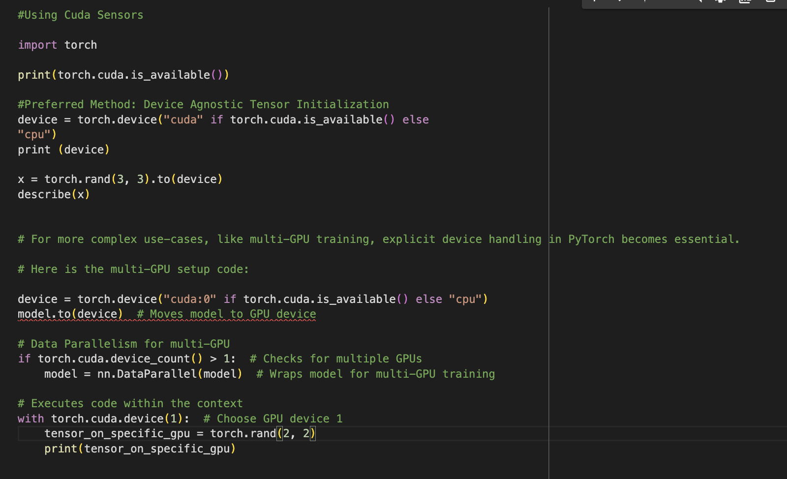
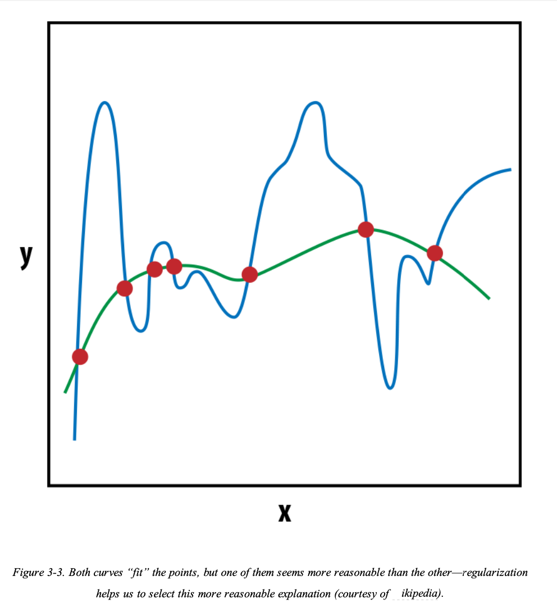

1. backpropagation: The process of iteratively updating the
parameters is called backpropagation. Each step (aka epoch) of
backpropagation consists of a forward pass and a backward pass. The
forward pass evaluates the inputs with the current values of the
parameters and computes the loss function. The backward pass updates
the parameters using the gradient of the loss.

2. One-Hot Representation : The one-hot representation, as the name suggests, starts with a zero vector,
and sets as 1 the corresponding entry in the vector if the word is present in
the sentence or document. Consider the following two sentences:

3. TF Representation (Term Frequency): The TF representation of a phrase, sentence, or document is simply the sum
of the one-hot representations of its constituent words., using the aforementioned one-hot encoding, the sentence
“Fruit flies like time flies a fruit” has the following TF representation: [1,
2, 2, 1, 1, 0, 0, 0]. Notice that each entry is a count of the number of
times the corresponding word appears in the sentence (corpus). We denote
the TF of a word w by TF(w).

4. TFIDF Representation (Term Frequency Inverse Document Frequency):Consider a collection of patent documents. You would expect most of them
to contain words like claim, system, method, procedure, and so on, often
repeated multiple times. The TF representation weights words
proportionally to their frequency. However, common words such as “claim”
do not add anything to our understanding of a specific patent. Conversely, if
a rare word (such as “tetrafluoroethylene”) occurs less frequently but is
quite likely to be indicative of the nature of the patent document, we would
want to give it a larger weight in our representation. The InverseDocument-Frequency (IDF) is a heuristic to do exactly that.
The IDF representation penalizes common tokens and rewards rare tokens
in the vector representation. he TF-IDF score is simply the product TF(w)
* IDF(w).

5. Any PyTorch method with
an underscore (_) refers to an in-place operation; that is, it modifies the
content in place without creating a new object, 

6. Tensor Types and Sizes: Each tensor has an associated type and size. The default tensor type when
you use the torch.Tensor constructor is torch.FloatTensor. However,
you can convert a tensor to a different type (float, long, double, etc.) by
specifying it at initialization or later using one of the typecasting methods.
There are two ways to specify the initialization type: either by directly
calling the constructor of a specific tensor type, such as FloatTensor or
LongTensor, or using a special method, torch.tensor(), and providing
the dtype.

7. Tensor Operations

8. Dimension based Tensors

9. Concatenating Tensors

10. Linear Algebra: Multiplication

11. Tensors and Computational Graphs
Creating tensors for gradient bookkeeping

12. Using Cuda Sensors(Compute Unified Device Architecture)

13. Exercise 

14. Visualizing Computation Graphs
You can visualize the computation graph using a tool like tensorboard or directly within PyTorch using the following methods:

15. Unigrams, Bigrams, Trigrams, ..., N-grams :
N­grams are fixed­length (n) consecutive token sequences occurring in the text. A bigram has two tokens, a unigram one.

16. Lemmas and Stems
Lemmas are root forms of words. Consider the verb fly. It can be inflected into many different words —flow, flew, flies, flown, flowing, and so on—and fly is the lemma for all of these seemingly different words. Sometimes, it might be useful to reduce the tokens to their lemmas to keep the dimensionality of the vector representation low. This reduction is called lemmatization
Stemming is the poor­man’s lemmatization.3 It involves the use of handcrafted rules to strip endings of words to reduce them to a common form called stems. Popular stemmers often implemented in open source packages include the Porter and Snowball stemmers.

17. POS Tagging : it is the process of categorizing words into tokens or documents.

18. NP (Noun Phrase) & NTR(Named Entity Recognition): Another type of span that’s useful is the named entity. A named entity is a string mention of a real­ world concept like a person, location, organization, drug name, and so on. Here’s an example:

10. Perceptron: The simplest neural network is called perception.

11. Activation Functions: Activation function are non-linearities introduced in neural networks to capture complex relationship between data.

It is also can be said as the feature representaion that are passed between the neurons/layers within the neural network that justifies previous relationship be it shape,size and features.

12. Sigmoid Activation Function: It is one of the earliest developed. It takes any real value and squash it onto range between 0 and 1. 

As you can observe signmoid can produce extreme values very quickly and for the majority of the inputs. This can lead to a problem where gradients are either 0 or divering to an overfitting float point value. This value is called vanishing gradient descent or exploding gradient descent problems. As of this, it is rare to see sigmoid used in neural network other than output as it squashes output to probablities.

13. tan h: It is a linear transform of sigmoid activation fucntion. It is also squashing function but it maps the set of real values from (–∞, +∞) to therange[­1, +1].

14. Re-Lu Activation Functions: It stands for rectified Linear unit. This is the most important of activation function. It clips all the negative values to zero. 
 
 
The ReLU (Rectified Linear Unit) activation function helps prevent vanishing gradients through its linear behavior for positive inputs. However, its zero gradient for negative inputs can lead to the "dying ReLU problem," where neurons become permanently inactive if they consistently receive negative inputs. This occurs because the gradient becomes zero for all negative values, preventing weight updates during backpropagation.

To address this limitation, variants like Leaky ReLU and Parametric ReLU (PReLU) were developed. These modifications allow a small, non-zero gradient for negative inputs:
- Leaky ReLU: uses a fixed small slope (typically 0.01) for negative values
- PReLU: uses a learnable parameter to determine the slope for negative values

These variants help maintain some gradient flow even for negative inputs, reducing the likelihood of neurons becoming permanently inactive.

15. Loss function: a loss function takes a truth (y) and a prediction (ŷ) as an input and produces a real­ valued score. The higher this score, the worse the model’s prediction is. PyTorch implements more loss functions in its nn package.

16. Mean Squared Error Loss
For regression problems for which the network’s output (ŷ) and the target (y) are continuous values, one common loss function is the mean squared error (MSE):

The MSE is simply the average of the squares of the difference between the predicted and target values. There are several other loss functions that you can use for regression problems, such as mean absolute error (MAE) and root mean squared error (RMSE), but they all involve computing a real­ valued distance between the output and target.

17. Categorical Cross Entropy Loss: The categorical cross entropy loss is used in multi class classificaiton problems where outputs are interpreted as predictions of class memebers probablities. the target (y) is vector of n elements that represents true multinominal distibutions of overall classes. If only one class is correct, this vector is a one­hot vector. The network’s output (ŷ) is also a vector of n elements but represents the network’s prediction of the multinomial distribution. Categorical cross entropy will compare these two vectors (y,ŷ) to measure the loss:

18. Binary cross-entropy loss measures how confident you were in the right answer between two classes.

If you guessed 100% sure it’s a cookie, the loss would be 0 (perfect!).
If you guessed 50-50, the loss would be higher (not confident enough 😕).
If you guessed 80% no, the loss would be HUGE! 🚨
Binary cross-entropy rewards confident correct guesses and penalizes wrong/confused guesses.

19. K-Fold Cross Validation is a technique to evaluate the performance of a model by dividing the dataset into k subsets (folds). The model is trained on k-1 folds and tested on the remaining fold. This process is repeated k times, with each fold being used as the test set exactly once.

20.Regularization;  The concept of regularization comes from numerical optimization theory. Recall that most machine learning algorithms are optimizing the loss function to find the most likely values of the parameters (or “the model”) that explains the observations (i.e., produces the least amount of loss). For most datasets and tasks, there could be multiple solutions (possible models) to this optimization problem. So which one should we (or the optimizer) pick? To develop an intuitive understanding, consider igure 3­3 for the task of fitting a curve through a set of points.
Both curves “fit” the points, but which one is an unlikely explanation? By appealing to Occam’s razor, we intuit that the simpler explanation is better than the complex one. This smoothness constraint in machine learning is called L2 regularization. In PyTorch, you can control this by setting the weight_decay parameter in the optimizer. The larger the weight_decay value, the more likely it is that the optimizer will select the smoother explanation (that is, the stronger is the L2 regularization).

